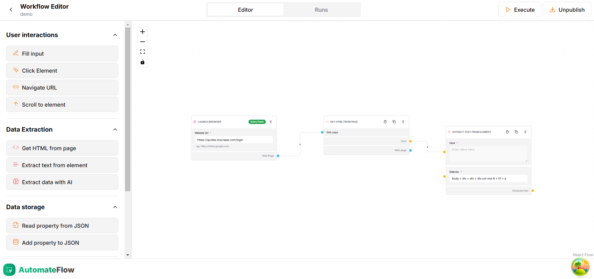
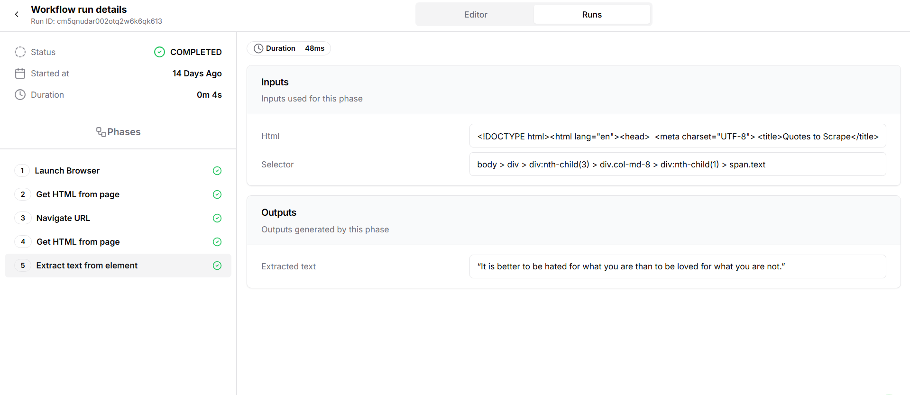
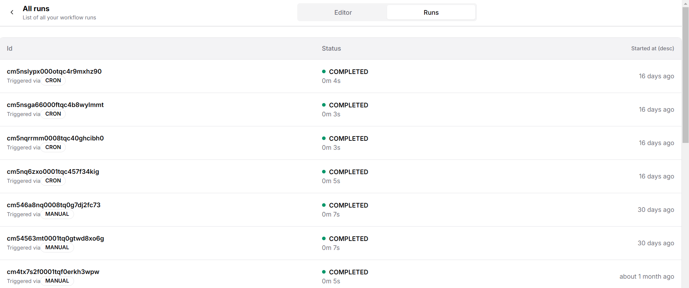
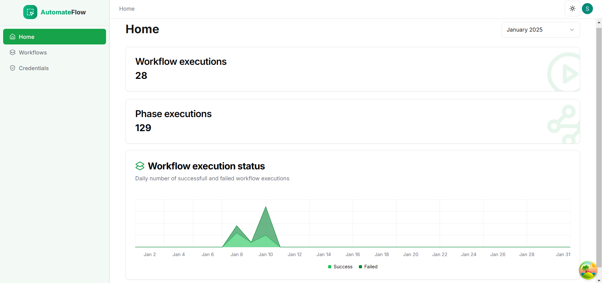

# AutomateFlow

AutomateFlow is a workflow automation tool built using **Next.js** and **TypeScript**. It simplifies web scraping tasks by allowing users to create, execute, and manage workflows effortlessly. The tool supports a wide range of scraping tasks, integrates AI for advanced functionality, and provides a sleek user interface for enhanced usability.

## Features

- **Workflow Automation:**
  - Create and execute workflows with zero manual intervention.
  - Supports the following tasks:
    - **Launch Browser:** Launches a browser to begin the workflow.
    - **Convert Page to HTML:** Extracts the HTML content of a webpage.
    - **Extract Text from Element:** Retrieves text content from a specific HTML element.
    - **Fill Input Field:** Automates the process of entering text into input fields.
    - **Click Element:** Simulates a click action on a specified element.
    - **Wait for Element:** Pauses execution until a specific element appears on the page.
    - **Deliver via Webhook:** Sends the scraped data to a specified endpoint via webhooks.
    - **Extract Data with AI:** Uses AI to extract structured data from webpages, returning results in JSON format.
    - **Read Property from JSON:** Reads specific properties from a JSON object.
    - **Add Property to JSON:** Adds new properties to a JSON object.
    - **Navigate to URL:** Directs the browser to a specified URL.
    - **Scroll to Element:** Scrolls the webpage to bring a specific element into view.

- **Flow Editor:**
  - Intuitive flow editor built with React Flow to create workflows using nodes and edges.

- **Execution Environment:**
  - Utilizes Puppeteer for robust task execution.
  - Supports cron job scheduling for automated, periodic workflow execution.

- **Secure Credential Management:**
  - Save credentials securely using symmetric encryption.

- **History Dashboard:**
  - Track and view the status of past executions.
  - Monitor up to 1,000+ execution logs with ease.

- **AI Integration:**
  - Powered by Gemini AI for advanced scraping tasks, with results returned in JSON format.

- **Elegant UI:**
  - User-friendly and aesthetically pleasing design built using Shadcn UI.
  - Includes **dark mode** support for an enhanced user experience.

## Tech Stack

- **Frontend:** Next.js, React, TypeScript, React Flow, Shadcn UI
- **Backend:** Prisma, SQLite, Puppeteer
- **Libraries:** React Query
- **Others:** Cron Jobs, Webhooks, Gemini AI Integration

## Screenshots

### Flow Editor


### Execution Page


### History Dashboard


### Home Page


## Installation

1. Clone the repository:
   ```bash
   git clone https://github.com/yourusername/AutomateFlow.git
   cd AutomateFlow
   ```

2. Install dependencies:
   ```bash
   npm install
   ```

3. Set up the database:
   - Ensure SQLite is installed.
   - Run the Prisma migrations:
     ```bash
     npx prisma migrate dev
     ```

4. Configure environment variables:
   - Create a `.env` file in the root directory.
   - Add the following variables:
     ```env
     ENCRYPTION_KEY=your_encryption_key_here
     GEMINI_API_SECRET=your_gemini_api_secret_here
     ```

5. Start the development server:
   ```bash
   npm run dev
   ```

6. Open the application in your browser at `http://localhost:3000`.

## Usage

1. **Create a Workflow:**
   - Use the Flow Editor to design workflows by connecting nodes and edges.
2. **Add Credentials:**
   - Save your credentials securely using the Credentials page.
3. **Execute Workflows:**
   - Run workflows manually or schedule them using the cron job feature.
4. **Monitor Executions:**
   - View the status of completed workflows on the History Dashboard.

## Contributing

Contributions are welcome! Please follow these steps:

1. Fork the repository.
2. Create a new branch:
   ```bash
   git checkout -b feature-name
   ```
3. Commit your changes:
   ```bash
   git commit -m 'Add feature-name'
   ```
4. Push to the branch:
   ```bash
   git push origin feature-name
   ```
5. Submit a pull request.

## Contact

For inquiries or support, contact [Satyam Vyas](mailto:vyas.satyam10@gmail.com).

---